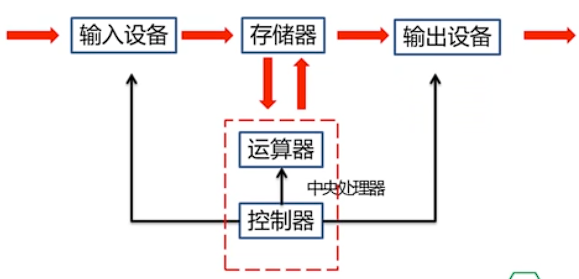
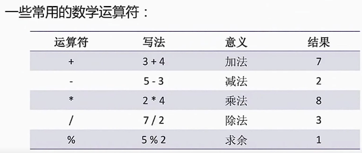

# ch1 编程初步

## 1. 什么是程序？什么是语言？

程序是为了得到某种结果，通过计算机**语言**表达的指令序列。

计算机语言是为了与计算机进行沟通而设计出来的语言。

## 2. 什么是计算思维？

计算思维是运用计算机科学的基础概念进行问题求解、系统设计、以及人类行为理解等涵盖计算机科学之广度的一系列思维活动。

计算思维解题的特点：

- 满足计算机程序执行的规则约束
- 发挥计算机的特长

## 3. 计算机发展史

- 图灵机
    - 组成：无限长的纸带，可移动的读头，状态寄存器，状态转换表
    - 工作原理：根据当前的状态和读入的纸带上的内容，进行状态转换：移动读头，或者擦写纸带上的内容
    - 图灵机是一个纯数学模型
    - 视频中提到的相关电影：《模仿游戏》

- 冯诺依曼体系结构

    - 计算机将指令序列存储在内存中，顺序执行，得到预期结果

        

    - 第一台现代电子计算机于 $1946$ 年在美国宾夕法尼亚大学问世，名为**电子数字积分计算机**，简称 $\tt ENIAC$​，设计初衷是计算导弹弹道

## 4. 程序的基本结构

```cpp
#include <iostream>
using namespace std;

int main()
{
    
    return 0;
}
```

- 包含库函数
    - 以符号 `#` 开头的行，称为**预编译行**
    - `#include` 称为**文件包含命令**
    - `#include <iostream>` 这条命令是让文件 `iostream` 的内容包含到新建的程序中去
    - `iostream` 是 C++ 语言提供的一个头文件，在这个头文件中设置了 C++ 的输入 / 输出相关环境，只有包含了这个头文件才能使用 `cout` 对象进行输出
- 命名空间
    - `using namespace` 称为**使用命名空间**命令，是为避免同名冲突而引入的
    - `std` 是 `iostream` 文件中定义的一个命名空间，由它定义了 C++ 的库标识符，比如 `cout` 等
    - 有了 `using namespace std;` 这句话，程序就可以直接使用 `std` 命名空间里面的标识符了
- 主函数
    - `int main()` 是每一个 C++ 程序都必须有的，称为主函数，可以把它看成是程序的入口
    - 符号 `{`  和 `}` 之间的部分是主函数的内容，分别表示主函数开始和结束
    - 在 `main` 前面的 `int` 是标准 C++ 所规定的，对应于在主函数结束前的 `return 0;`
- 标准输出
    - `cout` 为标准输出流对象，与显示器关联
    - `cout` 允许使用操作符 `<<` 将数据交给标准输出进行输出
    - `endl` 表示换行
- 语句
    - 每条语句结尾必须有 `;`，表示语句结束

## 5. 数学运算



- 使用时需要注意运算符的优先级，在不清楚优先级的情况下，可以通过添加圆括号达到自己的计算目的。
- 使用数学库函数时需要包含头文件：`#include <cmath>`
- 更多数学函数可以查阅[参考文档](https://zh.cppreference.com/w/cpp)
- **补充说明**
    - 上面这个参考文档的网站并不是视频中的网站，而是我认为相对较好的一个参考网站，可以中英文切换，视频中的网站在[这里](https://cplusplus.com/reference/)
    - `/` 的两个操作数如果都是整数，那么计算结果为整数商，只要有一个操作数为小数，计算结果就带小数
    - `%` 的两个操作数必须都是整数，否则会导致编译错误

## 6. 格式与风格

- `{` 和 `}` 之间的每一行的左侧多空了 $4$ 个空格，表示语句的层次关系
- 双目运算符前后有空格，看上去更为美观

## 7. 怎样学好程序设计？

- 重思路，举一反三
- 勤动手，多写程序
- 敢于提问，分享互助
- 学会阅读，积累经验