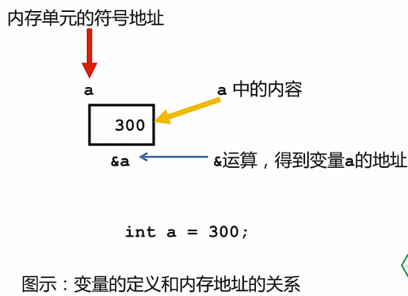

# ch2 变量与代数思维

## 1. 电子秤模拟

电子秤需求分析：

- 显示屏
- 按键：不同功能，不同水果
- 称量模块：测量并记录质量
- 存储模块：存储水果价格
- 计算模块：加法、乘法

用程序来模拟电子秤：

- 需要一种 “东西”，能存储数值 —— 变量
- 需要一种 “方法”，能接收外界输入 —— 输入流对象 `cin`

## 2. 变量的基本概念

程序中经过操作其值可以改变的量称为变量。变量在使用前必须加以声明。

每一个变量要有一个与其它变量不相同的合法的名字。第一个字符必须是字母或下划线，其后的字符只能是字母、数字和下划线，且不得与 C/C++ 语言系统所保留的关键字相同。

在给变量命名时考虑实际含义，以提高程序的易读性 —— 望文生义，约定俗成。

程序中的变量，事实上是以符号形式表达数学公式，完成一般性的求解。

## 3. 变量的数据类型

计算机中的各种数据是存储在内存空间中的，不同类型的数据占用大小不同的内存空间。

类型的作用是告诉计算机如何操作数据。类型 ”暗示“ 了运算的操作办法，不同类型的数值，参与运算的 ”操作规则“ 是不同的。例如整数相加需要将个位对齐，而小数相加则需要将小数点对齐。

基本数据类型：整型、浮点型、字符型、布尔型。

- `int`：整型，占用 $4$ 字节，表示范围为 $-2^{31} \sim 2^{31}-1$
- `unsigned int`：无符号整型，占用 $4$ 字节，表示范围为 $0 \sim 2^{32}-1$
- `long int`：长整型，占用 $4$ 字节，表示范围为 $-2^{31} \sim 2^{31}-1$
- `unsigned long int`：无符号长整型，占用 $4$ 字节，表示范围为 $0 \sim 2^{32}-1$
- `float`：单精度浮点型，占用 $4$ 字节，表示范围为 $-3.4 \times 10^{38} \sim 3.4 \times 10^{38}$
- `double`：双精度浮点型，占用 $8$ 字节，表示范围为 $-1.7 \times 10^{308} \sim 1.7 \times 10^{308}$
- `long double`：长双精度浮点型，占用 $10$ 字节，表示范围为 $-3.4 \times 10^{4932} \sim 1.1 \times 10^{4932}$
- `bool`：布尔型（逻辑型），占 $1$ 字节，只有 `true` 和 `false` 两个取值
- `char`：字符型，占 $1$ 字节

构造数据类型：数组、结构、联合、枚举等。所谓构造数据类型，是指这种类型的数据是由若干个基本数据类型的变量按特定的规律组合构造而成的。

## 4. 定义变量和变量初始化

定义变量的目的，是为了指出这些变量是什么数据类型，同时为变量分配内存单元。比如定义变量名为 $a$ 的整型变量：

```cpp
int a;
```

系统会根据上述语句的要求，分配 $4$ 个字节的内存单元存放 $a$ 变量的整数值，变量名 $a$ 是这个内存单元的名称。

定义变量的同时设置它的初始值，称为 “变量初始化”，比如：

```cpp
int a = 300;
```



值得注意的是，如果变量定义后没有赋值，则变量的内存单元中的值是一个随机的数值，在不同的机器上、不同的环境下，内存单元的内容是不同的。因此使用变量之前，首先赋予其一个有意义的值，否则可能得不到想要的结果。

## 5. 变量赋值

在 C/C++ 中，变量赋值是通过运算符 `=` 来完成的。赋值表达式的一般格式为 `<变量> = <表达式>`，例如：

```cpp
double c, pi;		// 定义变量 c 和 pi
pi = 3.14159;		// 将 3.14159 赋给变量 pi
c = sin(pi / 4);	// 将 pi / 4 的正弦函数值赋给变量 c
```

变量赋值的特点：

- 变量必须先定义再使用
- 在等号左边的变量，是被赋值的变量，对变量的赋值过程是一种 “覆盖” 过程，即：在变量地址单元中，用新值覆盖旧值
- 在等号右边的变量，是被 “使用”（“读取”）的变量。读取变量不会改变原有值，即：等号右边的表达式中出现的所有变量都保持原来的值不变

标准输入

- `cin` 表示输入流对象，它也是输入输出流库中的一部分，与之相关联的输入设备是键盘
- 由键盘输入的字符串形成输入流，用输入流运算符（也称提取操作符）`>>` 从输入流中读取数据存储到一个事先定义好的变量中。

## 6. 整数的二进制表示

整数 $s$ 的二进制表示可以用下式表达：

$$s = \sum_{i=0}^{n-1}d_i2^i，d_i \in \{0, 1\}$$

 其中 $d_i$ 表示第 $i$ 位上的数值，$2^i$ 表示第 $i$ 位上的位权，$n$ 表示二进制位数（$1$ 个字节占用 $8$ 位）。

## 7. 变量内存单元地址

可以通过取地址运算符 `&` 获取一个变量的地址：`&n` 会返回变量 $n$ 的内存单元地址。对于内存单元地址，`cout` 会自动以 $16$ 进制形式输出，在这种形式输出的结果中，前 $2$ 个字符固定为 `0x` 或 `0X`，这是在程序中书写 $16$ 进制数值时的前缀。

在输出字符变量的内存地址时，`cout` 不是输出字符变量的内存单元地址，而是输出内存单元存储的字符内容，且相邻的后续内存单元内容也以字符形式输出出来，直至碰到一个内容为 $0$ 的内存单元才停止。**这里需要对指针和字符串有一定的了解才能更好的理解，至于视频中演示的变量地址从上到下依次减少，是因为 C/C++ 中给变量分配内存单元遵循高地址优先原则。**

`TYPE* var;` 通常称为：`var` 是 `TYPE` 类型的指针变量。`TYPE` 类型的变量的地址值，只能赋值给 `TYPE` 类型所对应的指针变量，即：用 `TYPE*` 定义的变量。指针变量 `var` 加 / 减 $1$ 的单位是 `TYPE` 类型所占用的字节数。

```cpp
int n;
int* pn = &n;		// 将整型变量 n 的地址赋给整型指针变量 pn
*pn = 999;			// 将 999 赋给指针变量 pn 中存储的地址值所对应的内存单元（相当于 n = 999）
```

